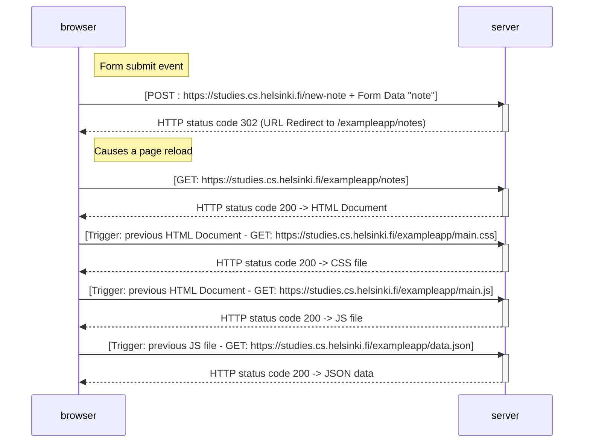

```mermaid
sequenceDiagram
participant browser
participant server
Note right of browser: Form submit event
browser->>server: [POST : https://studies.cs.helsinki.fi/new-note + Form Data "note"]
activate server
server-->>browser: HTTP status code 302 (URL Redirect to /exampleapp/notes)
deactivate server
Note right of browser: Causes a page reload


browser->>server: [GET: https://studies.cs.helsinki.fi/exampleapp/notes]
activate server
server-->>browser: HTTP status code 200 -> HTML Document
deactivate server
browser->>server: [Trigger: previous HTML Document - GET: https://studies.cs.helsinki.fi/exampleapp/main.css]
activate server
server-->>browser: HTTP status code 200 -> CSS file
deactivate server

browser->>server: [Trigger: previous HTML Document - GET: https://studies.cs.helsinki.fi/exampleapp/main.js]
activate server
server-->>browser: HTTP status code 200 -> JS file
deactivate server


browser->>server: [Trigger: previous JS file - GET: https://studies.cs.helsinki.fi/exampleapp/data.json]
activate server
server-->>browser: HTTP status code 200 -> JSON data
deactivate server
```
