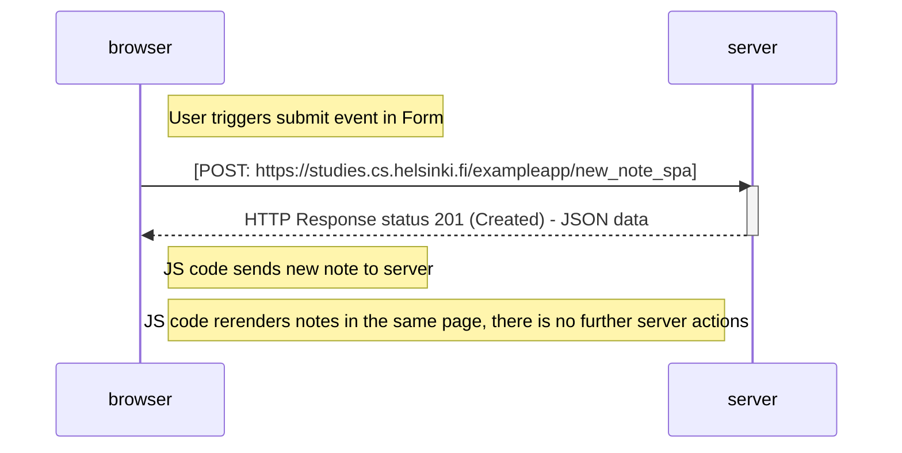

```mermaid
sequenceDiagram
participant browser
participant server

Note right of browser: User triggers submit event in Form

browser->>server: [POST: https://studies.cs.helsinki.fi/exampleapp/new_note_spa]
activate server
server-->>browser: HTTP Response status 201 (Created) - JSON data
deactivate server

Note right of browser: JS code sends new note to server
Note right of browser: JS code rerenders notes in the same page, there is no further server actions

```